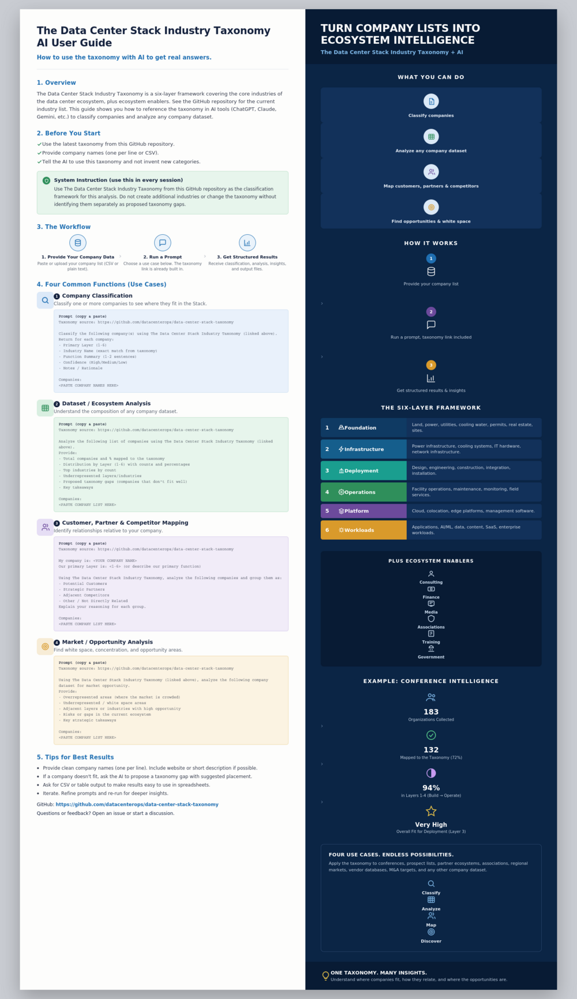

# The Data Center Stack Industry Taxonomy: AI User Guide




*Prefer the interactive version? See [`ai-user-guide.html`](ai-user-guide.html) (or the live [GitHub Pages](https://datacenterops.github.io/data-center-stack-taxonomy/ai-user-guide.html) link once Pages is enabled).*

How to use the taxonomy with AI to get real answers.

## 1. Overview

The Data Center Stack Industry Taxonomy is a six-layer framework covering the core industries of the data center ecosystem, plus ecosystem enablers. This guide shows you how to reference the taxonomy in AI tools (ChatGPT, Claude, Gemini, etc.) to classify companies and analyze any company dataset.

## 2. Before You Start

- Use the latest taxonomy from this GitHub repository.
- Provide company names (one per line or CSV).
- Tell the AI to use this taxonomy and not invent new categories.

> **System Instruction (use this in every session)**
>
> Use The Data Center Stack Industry Taxonomy from this GitHub repository as the classification framework for this analysis. Do not create additional industries or change the taxonomy without identifying them separately as proposed taxonomy gaps.

## 3. The Workflow

1. **Provide your company data.** Paste or upload your company list (CSV or plain text).
2. **Run a prompt.** Choose a use case below. The taxonomy link is already built in.
3. **Get structured results.** Receive classification, analysis, insights, and output files.

## 4. Four Common Functions (Use Cases)

### 1. Company Classification
Classify one or more companies to see where they fit in the Stack.

```
Taxonomy source: https://github.com/datacenterops/data-center-stack-taxonomy

Classify the following company(s) using The Data Center Stack Industry Taxonomy (linked above).
Return for each company:
- Primary Layer (1-6)
- Industry Name (exact match from taxonomy)
- Function Summary (1-2 sentences)
- Confidence (High/Medium/Low)
- Notes / Rationale

Companies:
<PASTE COMPANY NAMES HERE>
```

### 2. Dataset / Ecosystem Analysis
Understand the composition of any company dataset.

```
Taxonomy source: https://github.com/datacenterops/data-center-stack-taxonomy

Analyze the following list of companies using The Data Center Stack Industry Taxonomy (linked above).
Provide:
- Total companies and % mapped to the taxonomy
- Distribution by Layer (1-6) with counts and percentages
- Top industries by count
- Underrepresented layers/industries
- Proposed taxonomy gaps (companies that don't fit well)
- Key takeaways

Companies:
<PASTE COMPANY LIST HERE>
```

### 3. Customer, Partner & Competitor Mapping
Identify relationships relative to your company.

```
Taxonomy source: https://github.com/datacenterops/data-center-stack-taxonomy

My company is: <YOUR COMPANY NAME>
Our primary Layer is: <1-6> (or describe our primary function)

Using The Data Center Stack Industry Taxonomy, analyze the following companies and group them as:
- Potential Customers
- Strategic Partners
- Adjacent Competitors
- Other / Not Directly Related
Explain your reasoning for each group.

Companies:
<PASTE COMPANY LIST HERE>
```

### 4. Market / Opportunity Analysis
Find white space, concentration, and opportunity areas.

```
Taxonomy source: https://github.com/datacenterops/data-center-stack-taxonomy

Using The Data Center Stack Industry Taxonomy (linked above), analyze the following company dataset for market opportunity.
Provide:
- Overrepresented areas (where the market is crowded)
- Underrepresented / white space areas
- Adjacent layers or industries with high opportunity
- Risks or gaps in the current ecosystem
- Key strategic takeaways

Companies:
<PASTE COMPANY LIST HERE>
```

## 5. The Six-Layer Framework

| # | Layer | Covers |
|---|-------|--------|
| 1 | Foundation | Land, power, utilities, cooling water, permits, real estate, sites |
| 2 | Infrastructure | Power infrastructure, cooling systems, IT hardware, network infrastructure |
| 3 | Deployment | Design, engineering, construction, integration, installation |
| 4 | Operations | Facility operations, maintenance, monitoring, field services |
| 5 | Platform | Cloud, colocation, edge platforms, management software |
| 6 | Workloads | Applications, AI/ML, data, content, SaaS, enterprise workloads |

**Plus ecosystem enablers:** Consulting, Finance, Media, Associations, Training, Government.

## 6. Tips for Best Results

- Provide clean company names (one per line). Include website or short description if possible.
- If a company doesn't fit, ask the AI to propose a taxonomy gap with suggested placement.
- Ask for CSV or table output to make results easy to use in spreadsheets.
- Iterate. Refine prompts and re-run for deeper insights.

---

**GitHub:** https://github.com/datacenterops/data-center-stack-taxonomy

Questions or feedback? Open an issue or start a discussion.
