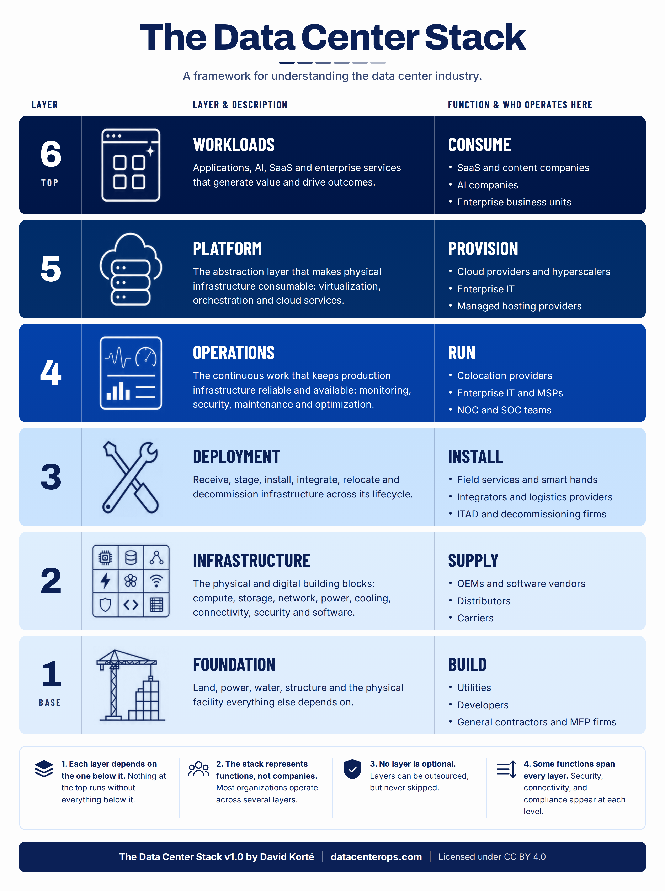

# The Data Center Stack

An open framework and taxonomy for understanding how the data center industry fits together.

**Current Release:** [v1.0](https://github.com/datacenterops/the-data-center-stack/releases/tag/v1.0)

[Download PNG](./the-data-center-stack-v1-0.png) |
[Download PDF](./the-data-center-stack-v1-0.pdf) |
[View HTML Source](./the-data-center-stack-v1-0.html)

---

## Overview

The data center industry is highly interconnected, but there is no simple, shared framework for explaining how its major functions fit together.

The Data Center Stack organizes the industry into six functional layers, moving from the physical facility at the base to the applications and digital services at the top.

The goal is not to classify companies into a single box. Most organizations operate across several layers.

The goal is to create a common language for understanding the ecosystem, the dependencies between different parts of the industry, and where companies, technologies, services and people fit within it.

The project consists of two connected parts:

- **The Data Center Stack Framework** provides the simple six-layer model.
- **The Data Center Stack Taxonomy** provides a structured classification system for mapping the industries and specialties operating across those layers.

Together, they provide both a high-level view of the industry and a way to explore the ecosystem in much greater detail.

## The Six Layers

### 1. Foundation

**Function: Build**

Land, power, water, structure and the physical facility everything else depends on.

**Who operates here:** Developers, utilities, engineering firms, general contractors, construction companies and data center operators.

### 2. Infrastructure

**Function: Supply**

The physical and digital building blocks: compute, storage, network, power, cooling, connectivity, security and software.

**Who operates here:** Equipment manufacturers, technology vendors, carriers, distributors and infrastructure suppliers.

### 3. Deployment

**Function: Install**

Deploy, integrate, migrate, upgrade, relocate and retire infrastructure across its lifecycle.

**Who operates here:** Field services and smart hands providers, integrators and logistics providers, ITAD and decommissioning firms.

### 4. Operations

**Function: Run**

Monitor, secure, maintain and optimize production infrastructure for reliability and uptime.

**Who operates here:** Data center operations teams, managed service providers, network operations teams, security providers and maintenance organizations.

### 5. Platform

**Function: Provision**

Turn physical infrastructure into consumable capacity through virtualization, orchestration and cloud services.

**Who operates here:** Cloud providers, hosting companies, virtualization platforms, orchestration providers and infrastructure software companies.

### 6. Workloads

**Function: Consume**

Applications, data and digital services that create demand for everything below them.

**Who operates here:** Enterprises, SaaS companies, AI platforms, content providers, financial services, government organizations and other users of digital infrastructure.

## The Industry Taxonomy

The six layers provide the high-level model. The **Data Center Stack Taxonomy** extends that model into a structured classification system for the broader data center ecosystem.

The taxonomy follows a hierarchy:

**Stack Layer → Industry Group → Industry → Specialty**

The current taxonomy includes more than 80 core industry definitions along with Ecosystem Enablers that influence the industry without fitting cleanly into one operational layer.

Each industry can include structured information such as:

- Permanent identifiers
- Definitions
- Inclusion and exclusion criteria
- Specialties
- Keywords
- Classification rules

The taxonomy is designed to be understandable by people while also being structured enough for software, datasets and AI systems.

**[Explore the Data Center Stack Taxonomy](./taxonomy/)**

The canonical taxonomy is maintained in YAML, with additional machine-readable formats derived from that source.

## Why It Matters

The data center industry is often described through individual markets, technologies or company categories.

Construction sees one ecosystem. Power sees another. Networking, logistics, operations, cloud and AI each see different parts of the same system.

The Data Center Stack provides a common reference point.

### Understand the ecosystem

The six-layer model provides a simple way to see how physical facilities ultimately become digital workloads and services.

### Create a common language

A shared framework makes it easier for people working in different parts of the industry to communicate without assuming everyone sees the ecosystem the same way.

### Identify relationships

The taxonomy makes it possible to explore where industries overlap and identify potential customers, suppliers, partners, competitors and adjacent markets.

### Classify the industry

Structured definitions create the foundation for consistently mapping companies, technologies, services, events and other parts of the data center ecosystem.

## Four Principles

### 1. Functions, not companies

The Stack classifies what is being done, not the organization doing it.

A single company may operate across several layers.

### 2. Dependencies flow through the Stack

Every layer depends on capabilities provided by the layers beneath it.

Digital workloads ultimately depend on physical infrastructure.

### 3. The boundaries are intentionally broad

The framework is designed to make a complicated industry easier to understand, not create rigid boundaries between every technology or business model.

The taxonomy provides additional detail where it is useful.

### 4. The framework should evolve

The data center industry changes constantly.

New technologies, infrastructure models and services will create categories that do not fit perfectly into today's definitions. The framework and taxonomy are intended to evolve with the industry while maintaining a stable underlying structure.

## Potential Uses

The Data Center Stack can be used for:

- Industry education and training
- Market and ecosystem mapping
- Company and technology classification
- Competitive analysis
- Partner and supplier discovery
- Event and conference analysis
- Workforce and career mapping
- Market research
- AI and software classification
- Identifying gaps and opportunities across the ecosystem

These are examples, not limits. One of the goals of making the project open is to see what other people build with it.

## Project Structure

The repository contains:

- **The Data Center Stack v1.0** visual framework
- **Taxonomy** with structured industry classifications
- **YAML, JSON and CSV data** for machine-readable use
- **PNG, PDF and HTML** versions of the framework
- **Documentation** explaining the methodology and classification approach

Start with the six-layer framework for the big picture, then use the taxonomy when you need deeper industry-level classification.

## Historical Context

The idea of describing the data center as a layered stack is not new.

In 2009, members of **Data Center Pulse** proposed a seven-layer “Data Center Stack,” modeled in part on the OSI networking model. The concept was covered by **Rich Miller in Data Center Knowledge** in *What Would a Data Center Stack Look Like?* on April 7, 2009.

The current Data Center Stack project was developed independently and takes a different approach, focusing on the modern data center ecosystem as six functional layers and extending that model with an open, machine-readable industry taxonomy.

The earlier work is worth recognizing as part of the history of applying layered models to data center infrastructure.

**Reference:** [What Would a Data Center Stack Look Like? — Data Center Knowledge, 2009](https://www.datacenterknowledge.com/build-design/what-would-a-data-center-stack-look-like-)

## Contributing

The Data Center Stack is an open project.

Feedback is welcome from people across the data center ecosystem, including operators, engineers, technicians, manufacturers, developers, contractors, logistics providers, cloud companies, researchers and others working across digital infrastructure.

If you think an industry is missing, a definition needs improvement, a classification belongs somewhere else, or the framework does not accurately represent part of the ecosystem, open an Issue or join the Discussion.

The goal is not to make the framework more complicated.

The goal is to make it more useful.

## Versioning

The Data Center Stack framework and taxonomy will evolve as the industry changes and the classification system is tested against real-world companies, technologies and use cases.

Major framework changes will be reflected in versioned releases.

Taxonomy definitions may evolve more frequently as classifications are tested and refined.

## License

The Data Center Stack is licensed under the [Creative Commons Attribution 4.0 International License (CC BY 4.0)](./LICENSE).

You are free to share and adapt the framework and taxonomy, including for commercial use, provided appropriate attribution is given.

Suggested attribution:

**The Data Center Stack by David Korté / DatacenterOps.com**

## About

The Data Center Stack was created by **David Korté**, founder of [DatacenterOps.com](https://datacenterops.com), to provide a simpler way to understand the increasingly complex data center ecosystem.

The project is being developed openly so the framework can be tested, challenged and improved by people working across the industry.

**The Data Center Stack v1.0**

[GitHub Repository](https://github.com/datacenterops/the-data-center-stack) | [DatacenterOps.com](https://datacenterops.com)

*Licensed under CC BY 4.0.*
